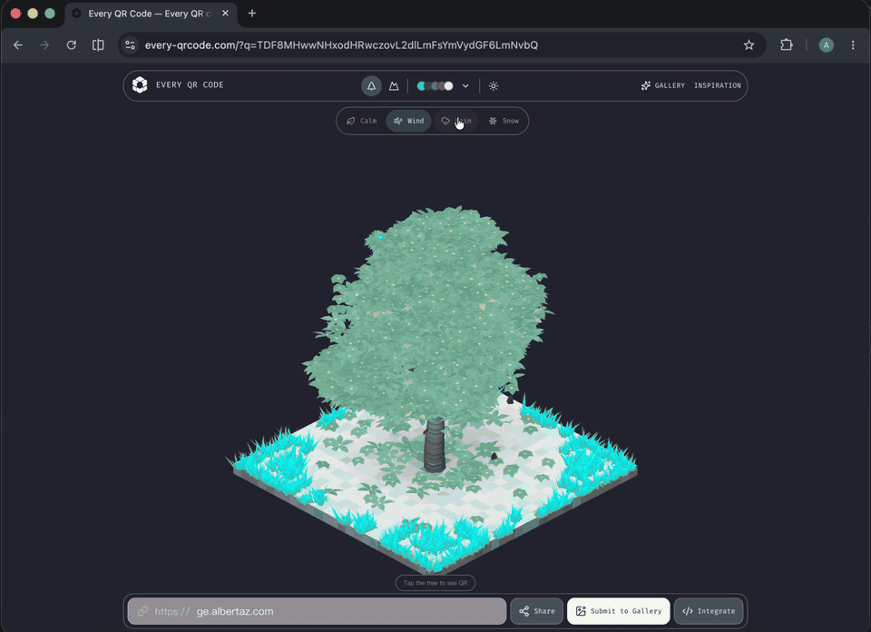
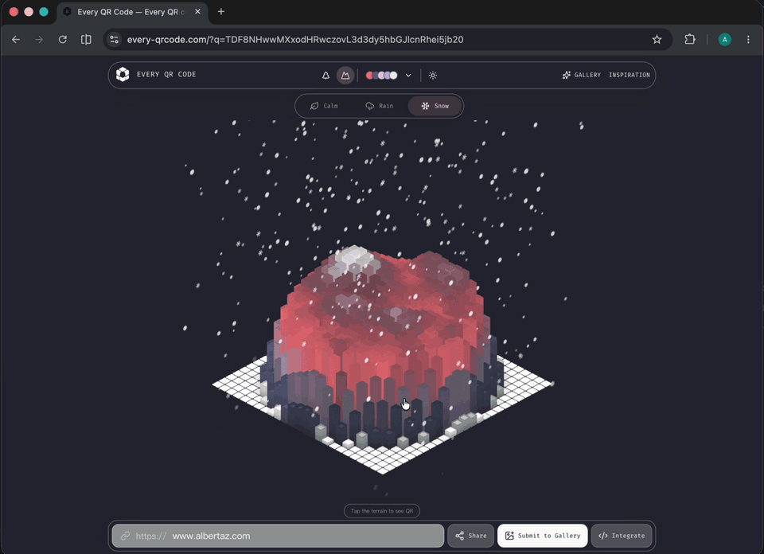

# Every QR Code

[English](README.md) | **简体中文**

**一个开源的 React QR Code 生成器和 Web Component：把 URL 变成确定性、可扫描的 3D
世界。** 你可以选择 Tree 或 Terrain，再让它变回对应的标准二维码。

[在线体验](https://every-qrcode.com/) ·
[React npm](https://www.npmjs.com/package/@every-qrcode/react) ·
[Web Component npm](https://www.npmjs.com/package/@every-qrcode/web-component) ·
[参与贡献](CONTRIBUTING.md)

```bash
pnpm add @every-qrcode/react
```

[](https://www.npmjs.com/package/@every-qrcode/react)
[](https://www.npmjs.com/package/@every-qrcode/web-component)
[](LICENSE)

### Tree



### Terrain



Every QR Code 可以把一个 URL 变成确定性、可扫描的 3D 世界。相同的标准化身份、模型和
generator version 会产生相同的 QR 矩阵和视觉基因。你可以在 Tree、Terrain 和标准二维码
之间切换，而目标链接保持不变。

你可以使用 React 组件、与框架无关的 Web Component，或者更底层的 TypeScript 和 WebGPU
包。所有渲染都在浏览器本地完成，不包含遥测，也不会调用服务器。

## 为什么使用 Every QR Code？

- **从设计上保证可扫描**——每个世界都可以变回对应的标准 QR 矩阵。
- **带版本的视觉身份**——已经保存的世界继续使用创建它时的生成器。
- **两个懒加载 3D 模型**——只在选择 Tree 或 Terrain 时加载对应的 shader bundle。
- **支持 React 和 Web Components**——在不同前端技术栈中使用同一套渲染器。
- **WebGPU 降级方案**——不支持 WebGPU 时显示静态、可扫描的 SVG QR Code。
- **保护隐私**——生成过程完全在本地运行，不包含分析或网络请求。

## React QR Code 组件

```tsx
import { EveryQRCode } from "@every-qrcode/react";

export function WebsiteIdentity() {
  return <EveryQRCode url="https://example.com" />;
}
```

组件默认使用 Tree、站点级身份、优先显示 3D 模型，并支持点击显示二维码。需要时可以使用
`model="terrain"`、`initialView="qr"` 或 `identityScope="url"`。

## QR Code Web Component

```bash
pnpm add @every-qrcode/web-component
```

```js
import "@every-qrcode/web-component/auto";
```

```html
<every-qr-code url="https://example.com"></every-qr-code>
```

## Packages

| Package                                                     | 用途                                     |
| ----------------------------------------------------------- | ---------------------------------------- |
| [`@every-qrcode/react`](packages/react)                     | React 组件和带类型的展示 API             |
| [`@every-qrcode/web-component`](packages/web-component)     | 原生 Custom Element，可选择自动注册      |
| [`@every-qrcode/core`](packages/core)                       | URL 标准化、Link DNA 和标准 QR Code 生成 |
| [`@every-qrcode/renderer-webgpu`](packages/renderer-webgpu) | 懒加载的 Tree 和 Terrain WebGPU 渲染器   |

产品通常只需要安装 React 或 Web Component 包。它们会自动引入共享的 core 和 renderer。

## 模型和身份

- `model="tree"` 渲染确定性的 Tree 形态。
- `model="terrain"` 渲染确定性的 Terrain 形态。
- `identityScope="site"` 是默认值，同一主机名下的所有路径共享一个身份。
- `identityScope="url"` 会把完整的标准化 URL 纳入身份。
- 两个模型最终都会变回同一个标准 QR 矩阵。

## 可复现世界：generator v1 和 v2

Generator version 是一套“绘制世界的配方”，不是 npm 包版本：

```text
相同 URL + generator v1 → 原来的世界
相同 URL + generator v2 → 使用新配方生成的新世界
```

新的 npm 包可以同时包含 v1 和 v2。升级 npm 包不会自动把已经保存的 v1 世界变成 v2。

### 把版本和 URL 一起保存

如果一个世界需要保存或分享，请在创建时记录当前 generator version：

```tsx
import { CURRENT_GENERATOR_VERSION, EveryQRCode } from "@every-qrcode/react";

const savedWorld = {
  generatorVersion: CURRENT_GENERATOR_VERSION,
  url: "https://example.com",
};

<EveryQRCode generatorVersion={savedWorld.generatorVersion} url={savedWorld.url} />;
```

Web Component 使用相同规则，对应的属性是 `generator-version="1"`。

- 不需要保存世界？可以不传版本，直接使用当前生成器。
- 正在迁移没有版本的旧数据？一次性把缺失版本设为 `1`。
- 正在读取已保存的世界？把保存的版本原样传回组件。
- 当前包不支持这个世界的版本？请升级包；组件不会偷偷替换成另一套生成器。

### 这次升级增加了什么？

- React 新增公开的 `generatorVersion` 属性，Web Component 新增 `generator-version` 属性。
- 为 seed model、Tree/Terrain 几何和 shader 建立冻结的 v1 路径。
- 增加 golden fingerprint 测试，未来改动如果意外改变 v1，测试会失败。
- Studio 分享链接和 Gallery 数据保存 generator version，旧数据统一迁移为 v1。

未来加入 v2 时，包里会新增一套独立的 v2 实现，并让新建世界默认使用 v2。已经记录版本 1
的世界仍然使用保留下来的 v1 实现。

[Studio](https://every-qrcode.com/) 会把 generator version 和 URL、模型、主题一起保存在分享
链接中，因此已保存的链接会继续使用创建它时的视觉算法。

内部结构可以查看 [package architecture](packages/README.md) 和
[technical architecture](docs/technical-architecture.md)。如果要添加新的懒加载模型，请查看
[renderer model guide](docs/adding-renderer-model.md)。

## 参与贡献

你不需要一次完成整个 3D 模型。视觉参考、几何草图、确定性算法、WGSL shader、测试和文档
都可以成为一次有效贡献。

请先阅读 [CONTRIBUTING.md](CONTRIBUTING.md)，选择一个足够小的切入点。当前公开的模型路线图
包括 [Hokusai Waves、Crystalline 和 Mechanical](docs/model-roadmap.md)。

## 浏览器支持

交互式 3D 视图使用 WebGPU。如果 WebGPU 初始化失败，React 和 Web Component 会显示静态
SVG QR Code，确保链接仍然可以扫描。

## 本地开发

需要 Node.js 22+ 和 pnpm 10+。

```bash
pnpm install
pnpm dev
```

发布前运行：

```bash
pnpm test
pnpm typecheck
pnpm lint
pnpm build
pnpm format:check
```

维护者通过 [GitHub Release 工作流](docs/releasing.md) 发布 npm 包，并使用 npm Trusted
Publishing，不在 GitHub 中长期保存发布 token。

## License

[MIT](LICENSE)
